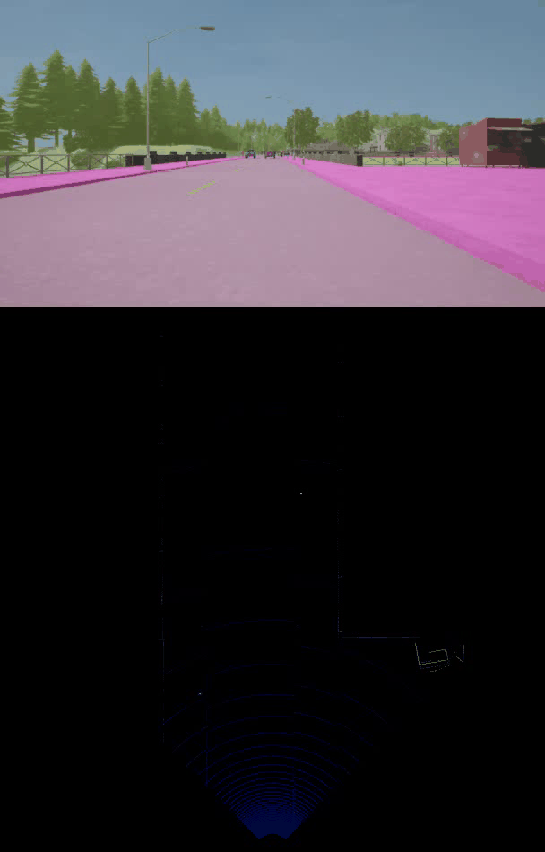

# SFA3D-PointPainting

[A Panoramic Awareness Network inspired by PointPainting and SFA3D](https://github.com/SekiroRong/SFA3D-PointPainting).

This work heavily based on two works:[GitHub - maudzung/SFA3D: Super Fast and Accurate 3D Object Detection based on 3D LiDAR Point Clouds (The PyTorch implementation)](https://github.com/maudzung/SFA3D) and [GitHub - AmrElsersy/PointPainting: Real Time Semantic Segmentation for both LIDAR &amp; Camera using BiseNetv2 &amp; PointPainting Fusion in Pytorch](https://github.com/AmrElsersy/PointPainting)




## Data Preparation

Refer to Carla-dataset-generator https://github.com/SekiroRong/Carla_dataset_generator

## Installation

Run

```
pip install -r requirements.txt
```

separately in PointPainting and SFA3D folder。

## PointPainting Part

### Download the checkpoint

[Download from Drive](https://drive.google.com/file/d/10-WxqSmyFKW72_1D-2vwu7BzUFlCOwgb/view?usp=sharing) Place it in "BiSeNetv2/checkpoints"  
**Important Note** The file you will download will have the name "BiseNetv2_150.pth.tar", 
don't unzip it .. just rename it to be "BiseNetv2_150.pth"

## SFA3D Part

### Visualize the dataset

To visualize 3D point clouds with 3D boxes, let's execute:

```shell
cd sfa/data_process/
python kitti_dataset.py
```

### Inference

The pre-trained model was pushed to this repo.

```
python test.py
```

### Training

Only support single GPU for now.

```shell
python train.py
```

## SFA3D-PointPainting Part

### Joint-Inference

```shell
cd SFA3D/sfa/
python joint_Inference.py
```

## Contact

If you think this work is useful, please give me a star!  
If you find any errors or have any suggestions, please contact me (**Email:** `sekirorong@gmail.com`) or in **Issues(Preferred)**

Thank you!

## References

[1] CenterNet: [Objects as Points paper](https://arxiv.org/abs/1904.07850), [PyTorch Implementation](https://github.com/xingyizhou/CenterNet)  
[2] RTM3D: [PyTorch Implementation](https://github.com/maudzung/RTM3D)  
[3] YOLOP：[YOLOP: You Only Look Once for Panopitic Driving Perception.）](https://github.com/hustvl/YOLOP)   
[4] PointPainting: [PointPainting: Sequential Fusion for 3D Object Detection](https://arxiv.org/abs/1911.10150), [PyTorch Implementation](https://github.com/AmrElsersy/PointPainting)    
[5] SFA3D：[GitHub - maudzung/SFA3D: Super Fast and Accurate 3D Object Detection based on 3D LiDAR Point Clouds (The PyTorch implementation)](https://github.com/maudzung/SFA3D)   
## Citation

```bash
@misc{SFA3D-PointPainting,
  author =       {Yu Rong, Mingbo Zhao},
  title =        {{SFA3D-PointPainting}},
  howpublished = {\url{https://github.com/SekiroRong/SFA3D-PointPainting}},
  year =         {2022}
}
```
